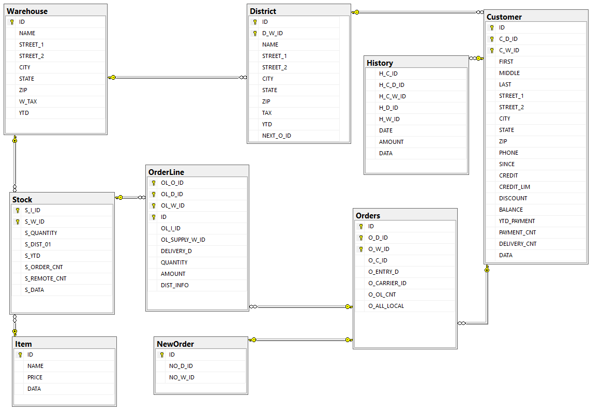

# Distribution Inventory Tracker

## Overview

This project consists of an Angular application and a .NET Core server, server is utilizing RabbitMQ for messaging, while Angular application is utilizing SignalR. The Angular application is built with version 16.1.2.




## Prerequisites

Before running the project, ensure you have the following prerequisites installed on your machine:

- Node.js and npm (for Angular)
- .NET Core SDK
- RabbitMQ Server
- SQL Server

## Project Structure

- `distinv` folder: Angular application
- `Server` folder: .NET Core server
- `DatabaseScript\script.zip` Initialization script for SQL Server

## Running the Angular Application

1. Navigate to the `distinv` folder:

    ```bash
    cd distinv
    ```

2. Install the required dependencies:

    ```bash
    npm install
    ```

3. Build and run the Angular application:

    ```bash
    ng serve
    ```

   The application will be accessible at `http://localhost:4200/`.

## Running the .NET Core Server

1. Navigate to the `Server` folder:

    ```bash
    cd Server
    ```

2. Build and run the .NET Core server:

    ```bash
    dotnet run
    ```

   The server will be accessible at `http://localhost:5263/`.

## Setting Up RabbitMQ Management Console

To enable the RabbitMQ Management Console for monitoring and managing your RabbitMQ server, follow these steps:

### For RabbitMQ Installed via Package Manager (apt, yum):

1. Install the RabbitMQ Management Plugin:

    ```bash
    sudo rabbitmq-plugins enable rabbitmq_management
    ```

2. Restart the RabbitMQ service:

    ```bash
    sudo service rabbitmq-server restart
    ```

### For RabbitMQ Installed via Homebrew (Mac):

1. Enable the RabbitMQ Management Plugin:

    ```bash
    rabbitmq-plugins enable rabbitmq_management
    ```

2. Start the RabbitMQ service:

    ```bash
    brew services start rabbitmq
    ```

### For RabbitMQ Installed as a Docker Container:

If you're running RabbitMQ as a Docker container, enable the Management Console during container creation:

    ```bash
    docker run -d --name rabbitmq -p 5672:5672 -p 15672:15672 rabbitmq:management
    ```


## Setting up RabbitMQ Exchange and Queue

To create a RabbitMQ fanout exchange named 'exchange' and bind it to a queue named 'myqueue', follow these steps:

1. Ensure that you have a RabbitMQ server running locally or update the connection information in the PowerShell script accordingly.

2. Run the PowerShell script `CreateRabbitMQExchange.ps1`:

   ```powershell
   .\CreateRabbitMQExchange.ps1

